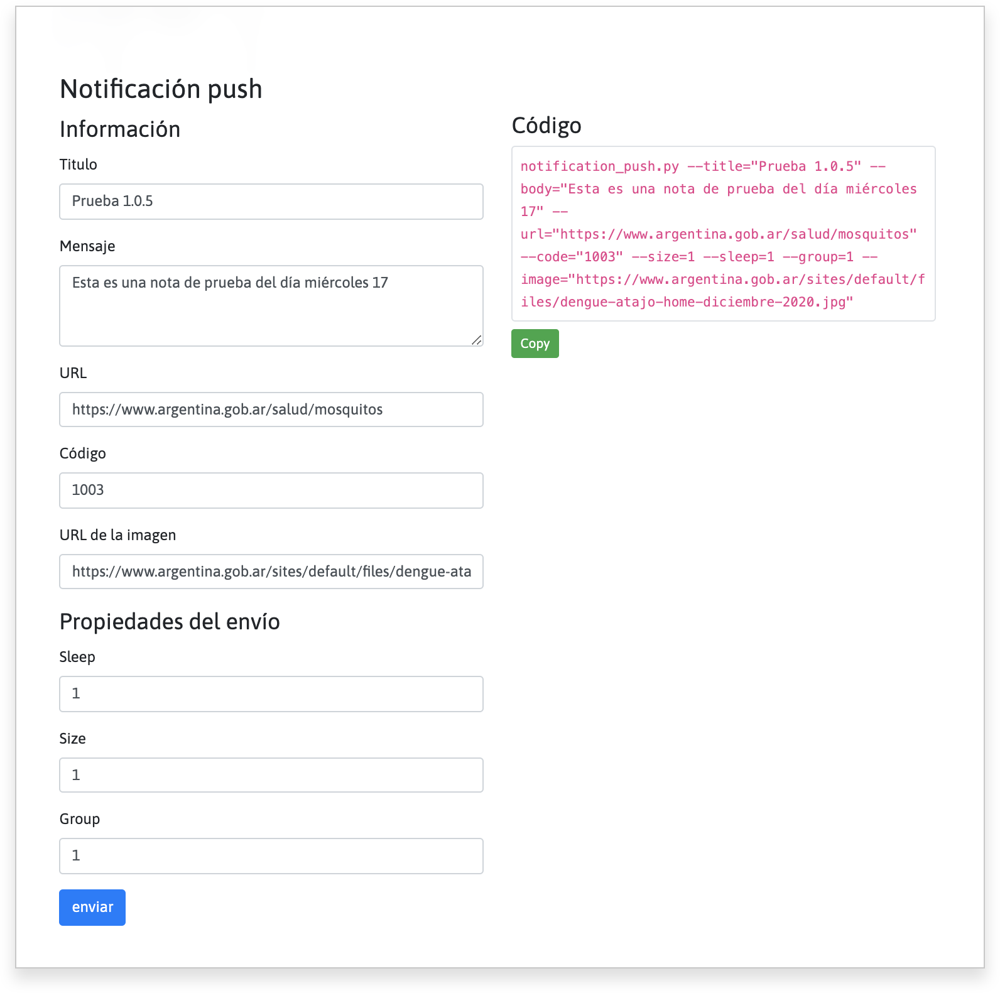

****# Notificación push

## Intalación

crear un _virtual enviroment_ para el proyecto de python. Se recomienda 
utilizar una versión de Python >= 3.6 


## Enviar notificaciones push

### Ayuda

Para obtener ayuda en la terminal puede ejecutar el comando `notificacion_push.py -h`. 
El resultado será el siguiente.

``` bash
usage: api_consola [-h] [-V] [-t TITLE] [-b BODY] [-u URL] [-c CODE] [-s SIZE] [-p SLEEP]
                   [-g GROUP] [-i IMAGE] [--credentials CREDENTIALS] [--tokens TOKENS]
                   [--logs-filepath LOGS_FILEPATH]

Permite enviar mensajes Push a diversos dispositivos

options:
  -h, --help            show this help message and exit
  -V, --version         Show version.
  -t, --title TITLE     Título para la notificación.
  -b, --body BODY       Mensaje
  -u, --url URL         Url de destino para la notificación.
  -c, --code CODE       Código de la API.
  -s, --size SIZE       Cantidad de token que se enviarán por lote.
  -p, --sleep SLEEP     Tiempo de espera entre grupo de tokens.
  -g, --group GROUP     Grupo de tokens dentro del lote.
  -i, --image IMAGE     URL de la imagen para la notificación.
  --credentials CREDENTIALS
                        Credenciales FireBase.
  --tokens TOKENS       Documento con el listado de tokens
  --logs-filepath LOGS_FILEPATH
                        Directorio donde se guardan los logs.
```

## Generador de código

Para evitar errores sintácticos en el código a ejecutar desde terminal se puede utilizar el generador de código ejecutando el archivo HTML _generador.html_. Se deben completar cada uno de los campos, luego presionar el botón _generar código_ y luego hacer clic en _copiar código_.

Pegue el código copiado en tu ventana de terminal anteponiendo el comando `python` o `python[version]` y presiona `enter`.



Este codigo se envia de este modo:

``` bash
python notification_push.py --title="Prueba 1.0.5" --body="Esta es una nota de prueba del día miércoles 17" --url="https://www.argentina.gob.ar/salud/mosquitos" --code="1003" --size=1 --sleep=1 --group=1 --image="https://www.argentina.gob.ar/sites/default/files/dengue-atajo-home-diciembre-2020.jpg"
```